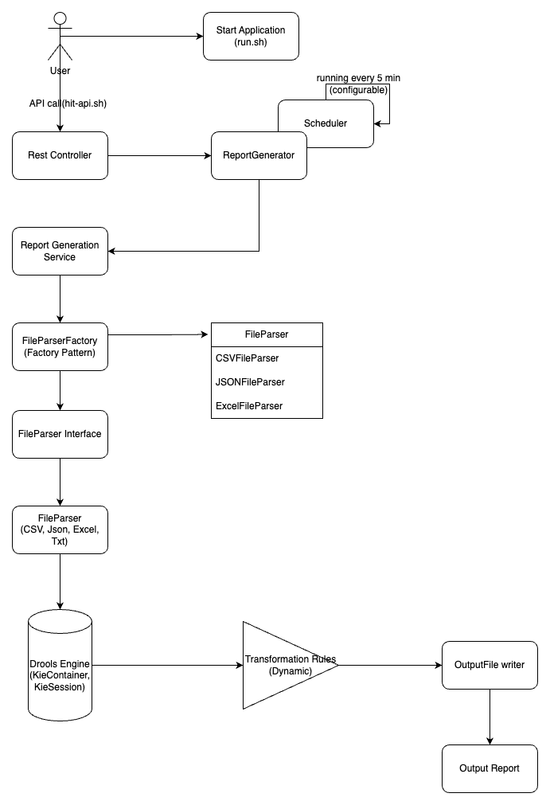

# ReportGenerator

Consider you are getting different set of feed files in csv format from an upstream source.
For each set of feeds you need to generate a report based on certain rules and reference data to lookup from reference files. There can be different set of feed files with each set containing the input.csv.
The report generation may be scheduled and the schedule can change in the future.
Create a java spring boot service that is able to ingest these files and create transformed reports in scheduled time.
One should also be able to trigger the report generation via Rest API.

Considerations:
1. Application may be enhanced in future to allow formats other than csv i.e. excel, json etc
2. Transformation rules can change in the future.
3. Output file format can change in the future.
4. The service may receive bigger files(more than 1GB file) in a high activity day.
5. Number of input and output fields can range up to 250
6. Report generation for a single file should be fast enough completing in less than 30 seconds

Sample Extract format details for a set ( In actual extract would be bigger and have data)

1. input.csv format (can be up to 1 GB in size)

    field1(String), field2(String), field3(String), field4(String), field5(Decimal), refkey1(String), refkey2(String)

2. reference.csv format linked to input via refkey1, refkey2 (can be up to 1 GB in size)

    refkey1(String), refdata1(String), refkey2(String), refdata2(String), refdata3(String),refdata4(Decimal)

3. Output.csv format

    outfield1, outfield2, outfield3, outfield4, outfield5

Transformation Rules (Configurable)

 1. outfield1 =field1+field2
 2. outfield2 = refdata1
 3. outfield3 = refdata2 + refdata3
 4. ~~outfield4 = field3 * max(field5,refdata4)~~ outfield4 = field3 + max(field5,refdata4) (_**Updated multiplication of field3 & max(field5,refdata4) to concatenation as one field is String & other is of Decimal type, therefore * operation is not supported**_)
 5. outfield5 = max(field5,refdata4)

Here's a high-level description of the proposed solution:

**ReportGenerator** : Scheduler is created to run transformation every 5 min. 
Cron expression is configurable in application.yml file.
Synchronization mechanism is implemented to ensure thread safety(when API call & scheduler both try to trigger report generation).

**Input Files**: CSV, JSON, Excel, or Text files containing input data and reference data.
To process your files, you can place your own input & reference file under src/main/resource folder or can pass file path in src/main/resource/application.yml file

**FileParserFactory**: Factory pattern to obtain the appropriate parser based on the input file type.
In future if file format is extended to other format we just need to add new class (following one of SOLID principle, Open for extension but closed for modification).

**File Parsers**: Interface and implementations for parsing different file types.

**Report Generation Service**: Service that processes input and reference files to generate the report.

**Drools Engine**: Business rules engine to apply transformation rules. 
In future if transformation rule changes we just need to apply those changes in .drl file. 
No need to make any changes in code. 
In case no of field in input, reference & output file increases more than 40(beyond manageable through Java object), rules to read those field from file can also be added.

**Output File**: Generated report in the desired format (e.g.CSV, JSON, Excel, Text).
You can find the output file under src/main/resource folder or define your own custom folder in application.yml file.

                                                                               BLOCK DIAGRAM

**COMPONENTS DESCRIPTION:**

**User**: Initiates report generation via REST API.

**ReportGenerator** : Scheduler is created to run transformation every 5 min.

**REST Controller/API**: Interface to trigger report generation manually.

**Report Generation Service**: Central service responsible for orchestrating the report generation process.

**FileParserFactory**: Factory pattern to obtain the appropriate parser based on the input file type. 

**FileParser Interface**: Interface implemented by specific file parsers (CSV, JSON, Excel, Text).

**FileParser**: Implementations of the file parser interface to parse different file types.

**Drools Engine**: Uses KieContainer and KieSession to process transformation rules defined in the .drl files.

**Transformation Rules**: Drools rules that define how input data is transformed based on reference data.

**OutputFile Writer**: Writes the transformed data to the output file in the desired format.

**Output Report**: The final generated report.

**STEPS TO RUN THE APPLICATION**

1. Run the following command to make the script executable:

   chmod +x run.sh

   chmod +x hit-api.sh

2. Execute the script to run your Spring Boot application & generate report:

   ./run.sh

   ./hit-api.sh

